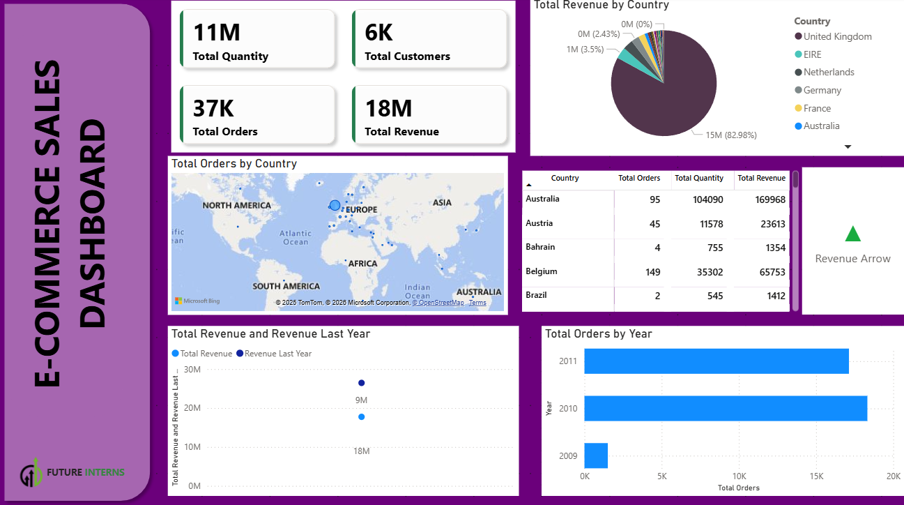

# 🛒 E-Commerce Sales Dashboard

A comprehensive Power BI dashboard analyzing e-commerce sales performance across multiple countries and time periods.

## 📊 Dashboard Overview

This interactive dashboard provides real-time insights into e-commerce sales metrics, enabling data-driven decision-making for business stakeholders.

### Key Performance Indicators (KPIs)

| Metric | Value |
|--------|-------|
| **Total Quantity** | 11M |
| **Total Customers** | 6K |
| **Total Orders** | 37K |
| **Total Revenue** | 18M |

## 🎯 Features

### 1. **Revenue by Country (Pie Chart)**
- Visual breakdown of revenue distribution across countries
- United Kingdom leads with **82.98%** of total revenue
- Other key markets: EIRE, Netherlands, Germany, France, Australia

### 2. **Geographic Distribution (Map Visual)**
- Interactive map showing order concentration by region
- Bubble sizes indicate order volume
- Focus on European and Australian markets

### 3. **Country Performance Table**
- Detailed metrics per country:
  - Total Orders
  - Total Quantity
  - Total Revenue
- Enables quick comparison across markets

### 4. **Year-over-Year Analysis**
- **Total Revenue vs Revenue Last Year** comparison
- Clear trend visualization showing growth trajectory
- Revenue increased from ~18M to ~29M

### 5. **Orders by Year (Bar Chart)**
- Historical order trends (2009-2011)
- 2010 shows peak performance with ~18K orders
- 2011 follows with ~15K orders

### 6. **Revenue Trend Indicator**
- Green arrow indicating positive revenue growth
- Quick visual cue for performance status

## 🔍 Key Insights

1. **Market Concentration**: The UK dominates with nearly 83% of total revenue, indicating a strong home market but potential opportunity for international expansion.

2. **Growth Trend**: Year-over-year revenue shows significant improvement, with the current period outperforming the previous year.

3. **Customer Base**: With 6K customers generating 37K orders, the average customer places approximately 6 orders, indicating strong customer loyalty.

4. **European Focus**: The majority of orders originate from European countries, with Australia being the primary market outside Europe.

5. **Volume vs Value**: Belgium shows 149 orders generating 65,753 revenue, while Australia has 95 orders generating 169,968 revenue, indicating higher-value transactions in Australia.

## 🛠️ Tools & Technologies

- **Power BI Desktop** - Dashboard creation and visualization
- **DAX** - Calculated measures and KPIs
- **Power Query** - Data transformation and cleaning
- **Bing Maps** - Geographic visualization

## 📁 Data Fields Used

- Order Date / Year
- Country
- Customer ID
- Order ID
- Quantity
- Revenue/Sales Amount

## 🚀 How to Use

1. Download the `.pbix` file
2. Open with Power BI Desktop
3. Refresh data connection if needed
4. Use slicers and filters for interactive exploration

## 📈 Future Enhancements

- [ ] Add product category breakdown
- [ ] Include monthly/quarterly trends
- [ ] Add customer segmentation analysis
- [ ] Implement drill-through pages
- [ ] Add forecasting visuals

## 👤 Author

Created as part of **Future Interns** Data Analytics Program

---

*This dashboard demonstrates proficiency in data visualization, business intelligence, and analytical storytelling using Microsoft Power BI.*
